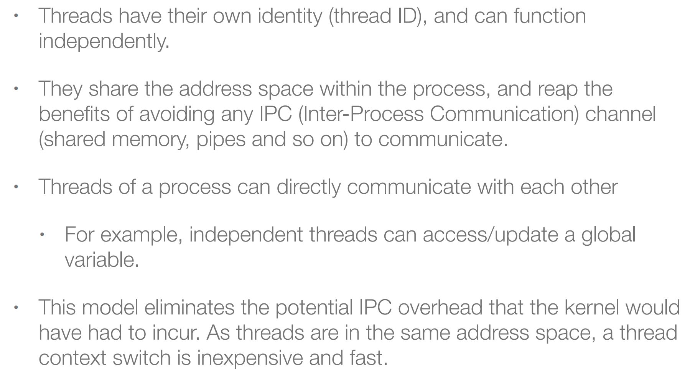
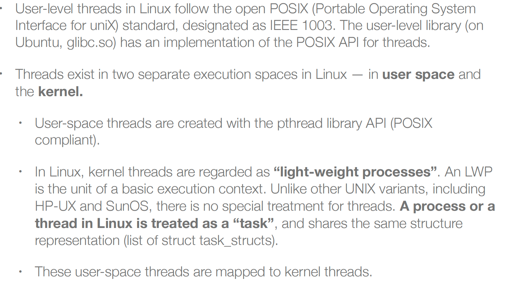
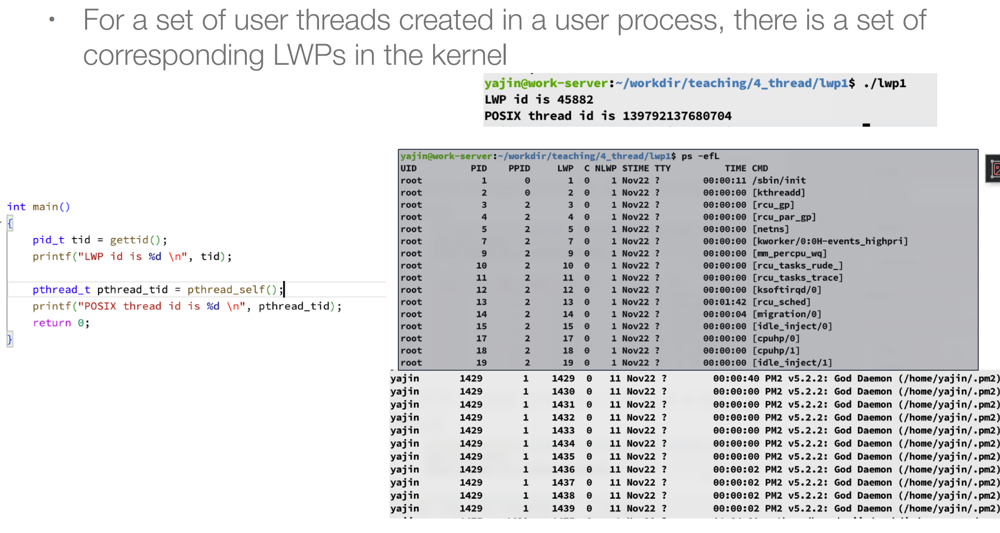
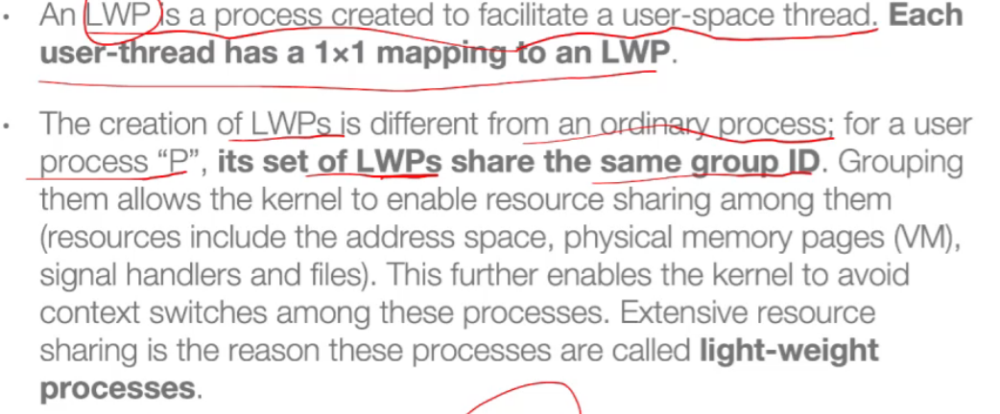
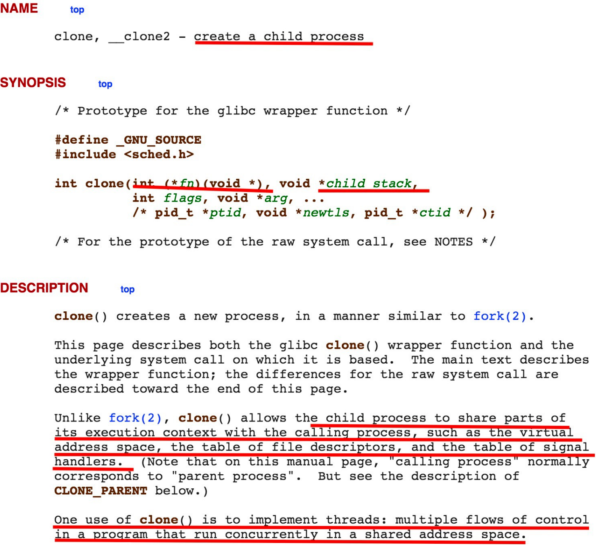
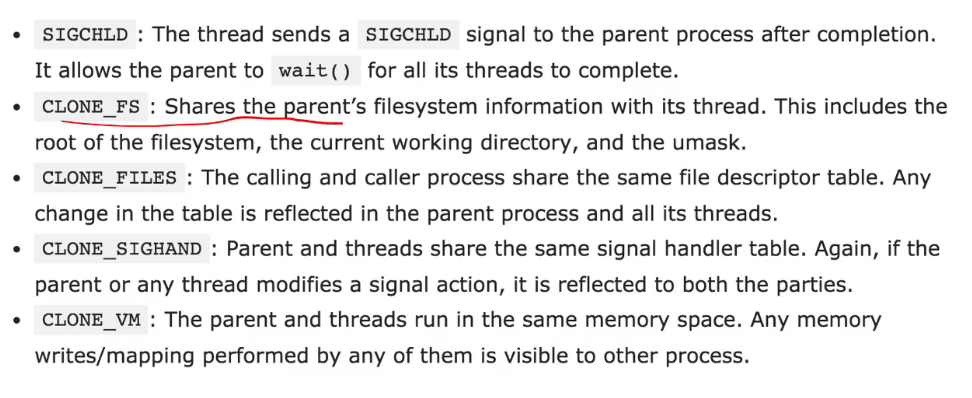

### Light-Weight Processes: Dissecting Linux Threads
#### 1. Thread
- 

#### 2. How does Linux implement threads？

- 

- NLWP就是一个进程中的线程数；
- 

#### 3. What is a Light-Weight Process

- LWP就是linux概念下的内核线程；
- 

#### 4. How to create LWP

- fork完全可以通过clone来实现，clone通过flag来控制资源是否共享；

- 

#### 5. 具体例子

```c
#define _GNU_SOURCE             /* See feature_test_macros(7) */
#include <sched.h>
#include <malloc.h> 
#include <sys/types.h> 
#include <sys/wait.h> 
#include <signal.h> 
#include <sched.h> 
#include <stdio.h> 
#include <fcntl.h> 
#include <stdlib.h>
#include <stdint.h>
#include <stdlib.h>


// 64kB stack 
#define STACK 1024*64 
 
// The child thread will execute this function 
int threadFunction( void* argument ) {
     printf( "child thread entering\n" ); 
     close((uintptr_t)argument); 
     printf( "child thread exiting\n" ); 
     return 0; 
}
 
int main() {
     void* stack; 
     pid_t pid; 
     int fd; 
 
     fd = open("/dev/null", O_RDWR); 
     if (fd < 0) { 
         perror("/dev/null"); 
         exit(1); 
     } 
 
     // Allocate the stack 
     stack = malloc(STACK); 
     if (stack == 0) {
         perror("malloc: could not allocate stack"); 
         exit(1); 
     }
     printf("Creating child thread\n"); 
 
     // Call the clone system call to create the child thread 
     pid = clone(&threadFunction, //
                 (char*) stack + STACK, //子进程栈在哪里
                 SIGCHLD | CLONE_FS | CLONE_FILES |
                  CLONE_SIGHAND | CLONE_VM, 
                 (void *)(uintptr_t)fd); 
 
     if (pid == -1) { 
          perror("clone"); 
          exit(2); 
     } 
 
     // Wait for the child thread to exit 
     pid = waitpid(pid, 0, 0); 
     if (pid == -1) { 
         perror("waitpid"); 
         exit(3); 
     } 
 
     // Attempt to write to file should fail, since our thread has 
     // closed the file. 
     if (write(fd, "c", 1) < 0) { 
         printf("Parent:\t child closed our file descriptor\n"); 
     } 
 
     // Free the stack 
     free(stack); 
 
     return 0; 
}


```

- 

```c

#define _GNU_SOURCE
#include <sched.h>
#include <sys/syscall.h>
#include <sys/wait.h>
#include <stdio.h>
#include <stdlib.h>
#include <string.h>
#include <unistd.h>

static int child_func(void* arg) {
  char* buf = (char*)arg;
  printf("[Child] Child sees buf = %p -  \"%s\"\n", buf, buf);
  strcpy(buf, "hello from child");
  return 0;
}

int main(int argc, char** argv) {
  // Allocate stack for child task.
  const int STACK_SIZE = 65536;
  char* stack = malloc(STACK_SIZE);
  if (!stack) {
    perror("malloc");
    exit(1);
  }

  // When called with the command-line argument "vm", set the CLONE_VM flag on.
  unsigned long flags = 0;
  if (argc > 1 && !strcmp(argv[1], "vm")) {
    flags |= CLONE_VM;
  }

  char buf[100];
  strcpy(buf, "hello from parent");
  if (clone(child_func, stack + STACK_SIZE, flags | SIGCHLD, buf) == -1) {
    perror("clone");
    exit(1);
  }

  int status;
  if (wait(&status) == -1) {
    perror("wait");
    exit(1);
  }

  printf("[Parent] Child exited with status %d. buf = %p - \"%s\"\n", status,buf, buf);
  return 0;
}


```
- CLONE_VM：共享memory；
- 

- 在fork情况下，父进程和子进程共享file descriptor（文件描述符 ），但不共享memory；
