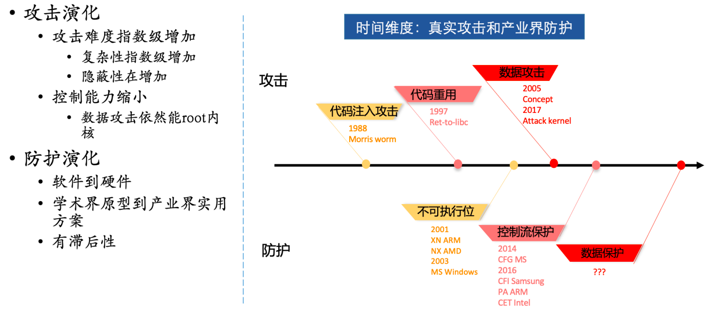

>第一课 4.24
## Class Overview

### 学习内容

- 了解常见的漏洞和攻击，Buffer overflow、ROP……
- 了解程序分析方法/工具
- 了解如何分析程序和编写漏洞利用
- 了解软件安全防御的一些措施，知道如何编写安全代码

**Attack & Defense**

## Introduction to Software Security

### Security vs Safety

Safety：是对随机事件的保护。随机事件是由于一个或多个巧合而发生的意外事件。
Security：是针对预期事件的保护。通常这种事件的发生是由于蓄意和有计划的行为造成的。

### Topics

- Vulnerabilities and Attacks

    - Buffer overflow, Return2libc/ROP, Format String Vulnerabilities

- Code analysis
    - Static analysis, taint analysis, symbolic/eoncolic execution,fuzzing
- Advanced topics
    - CFI/SFI
- Hardware-assisted protection
    - AEG

### 课程材料

- 《Software Security: Principles, Policies, and Protection》
- [CMPSC 447 Software Security – PSU](https://www.cse.psu.edu/~gxt29/teaching/cs447s19/index.html)
- [Software Security - EPFL](https://nebelwelt.net/teaching/19-412-SoSe/)

- 《计算机安全导论：深度实践》

