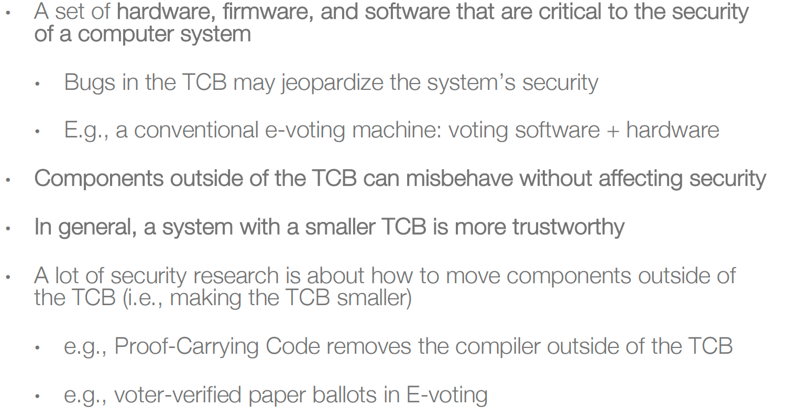
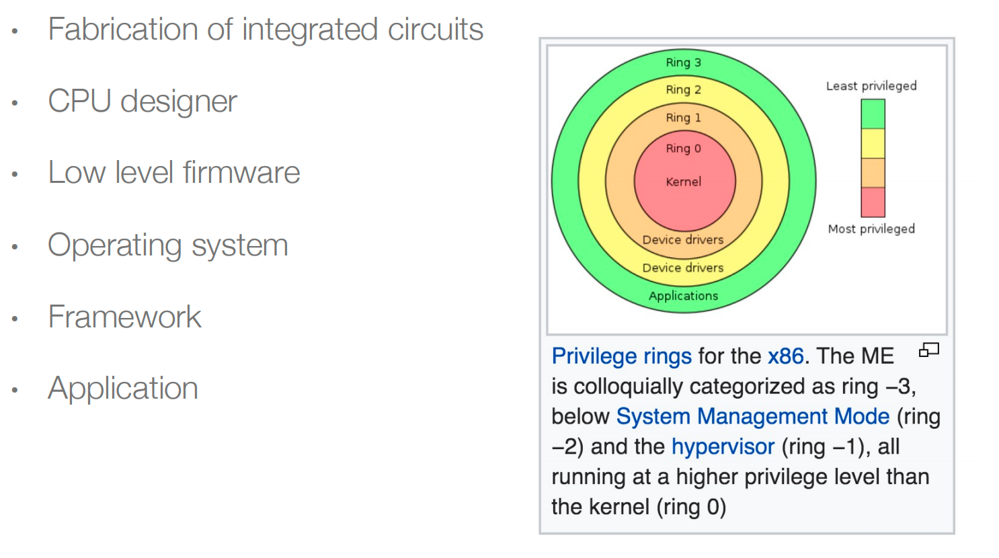
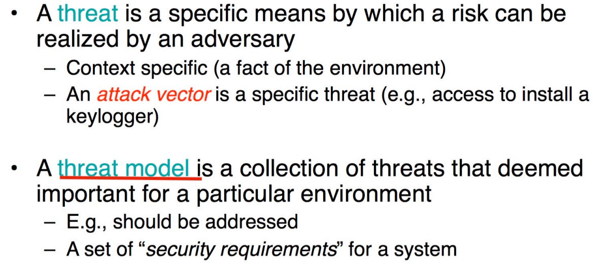
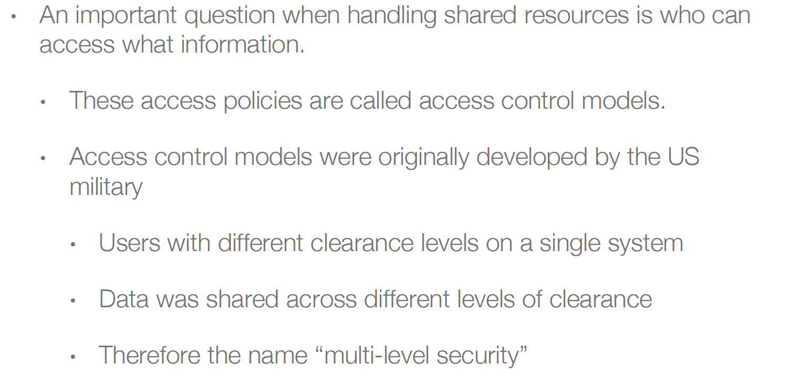
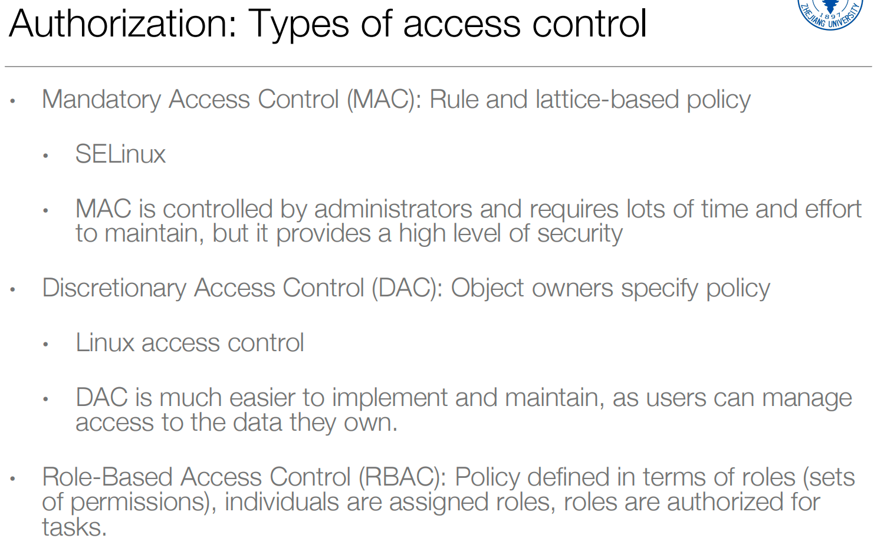
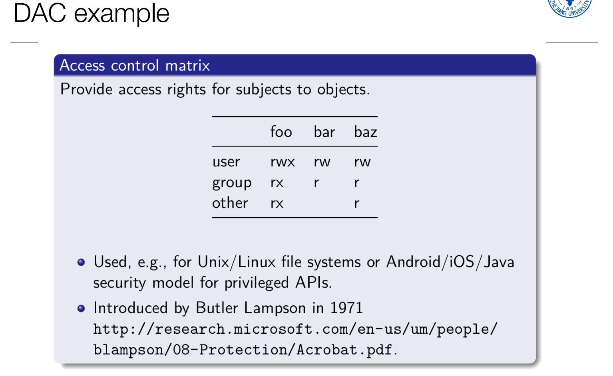

>第一课 4.24
### 一些基本概念

**What is security?**

- Confidentiality（私密性）：An attacker cannot recover protected data；
- Integrity（完整性）：An attacker cannot modify protected data；
- Availability（可用性）：An attacker cannot stop/hinder computation（阻止别人访问到自己的服务）；

**Adversary（对手）**

- 对手是任何试图绕过安全基础设施的个体；

**Trust**

- 信任是指一个实体的行为程度；

- 信任模型描述了对于某个特定环境，信任谁做什么；

**Trusted Computing Base (TCB)**

**Threats**

**Policy and Enforcement**

- Policy：谁被允许谁不允许做某事；
- Enforcement：强制使用policy的方法；

### Fundamental Security Mechanism

1. 隔离（Isolation）

One component cannot access data/code of the other component except through a well-defined API. For example, process.

2. 最小特权（Least privilege）

最小特权原则确保组件具有运行所需的最小特权，从组件中进一步删除的任何特权都会删除某些功能。

3. 错误隔离（Fault compartments）

和Isolation有粒度上的区别，错误隔离的粒度更细，指的是在一个component内存（比如在进程内部），对逻辑上不相关的部分进行隔离。

这样肯定是有代价的，隔离提高了安全性，同时降低了共享性，也就是效率会被降低。

4. 信任和正确性（Trust and correctness）

根据规范，假设特定的组件是可信的或正确的。

正式验证确保组件正确地实现给定的规范，因此可以被信任。请注意，此属性是通常无法实现的理想属性。

问题：如何确保本规范的正确性？如果规范被更新了怎么办？

### AAA

- **Authentication**: Who are you (what you know, have, or are)? 你是谁。
- **Authorization**: Who has access to object? 谁可以访问对象，验证完你是谁之后，你能干什么？
- **Audit**/**Provenance**: I’ll check what you did.

#### Authentication

- 你知道什么：用户名/密码（可以更换）
- 你是什么：一些生物特征（不能更换）
- 你有什么：second factor/智能卡

#### Authorization

这个人能够访问什么资源

**Vulnerabilities**：vulnerability是指有能力利用该flaw的对手可以访问（威胁）的flaw。

**Attacks**：当有人想利用某个Vulnerabilities，那么攻击就产生了。

