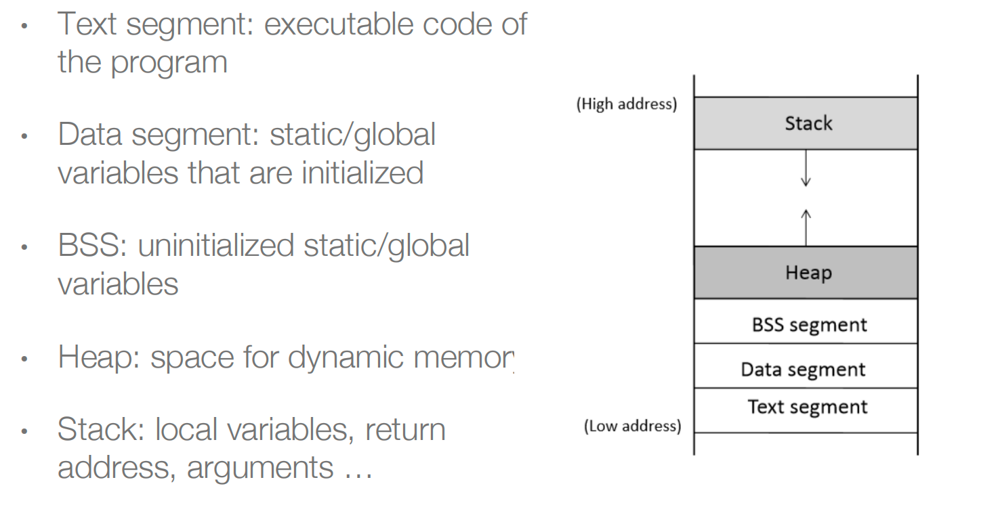
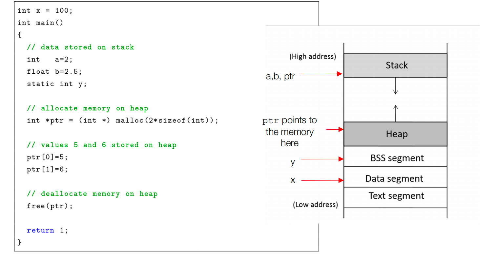
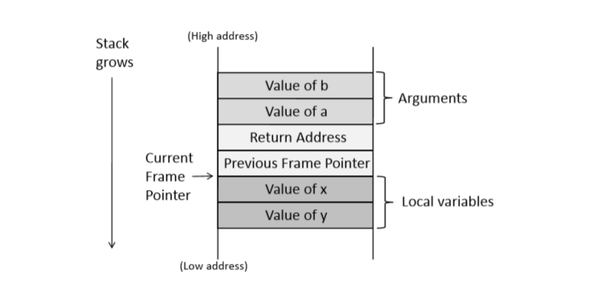
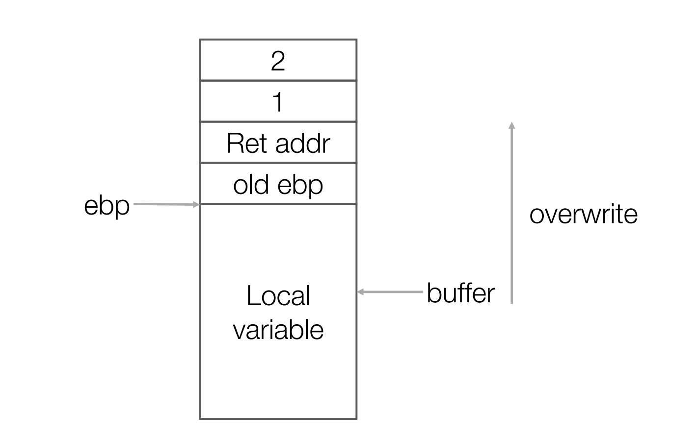
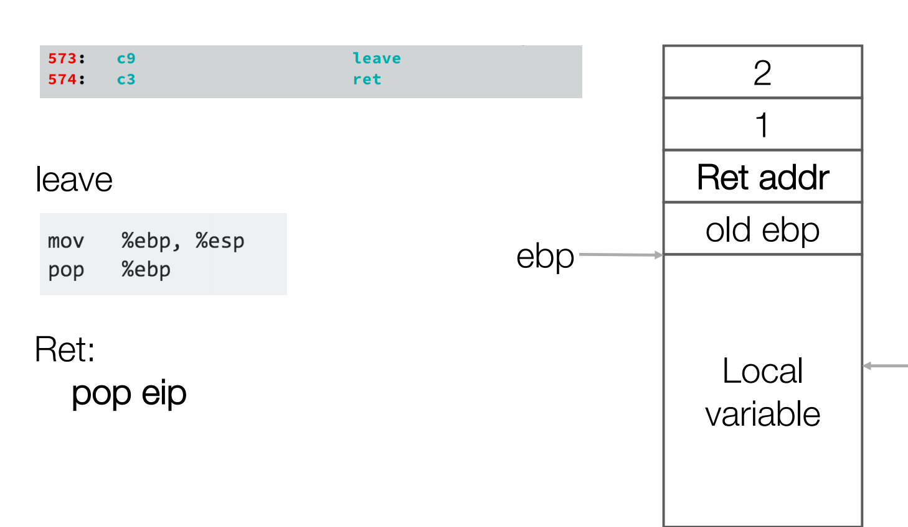
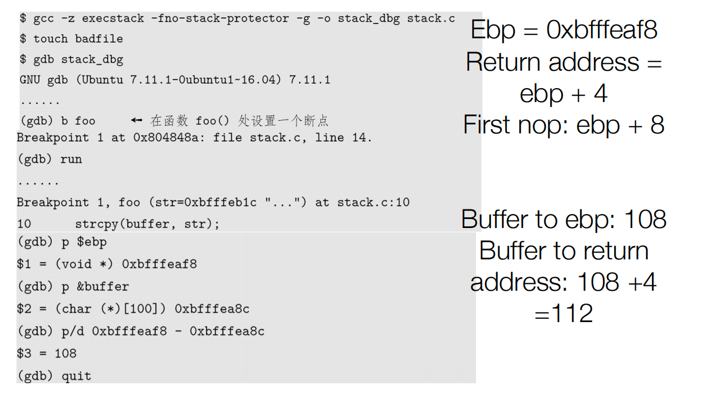
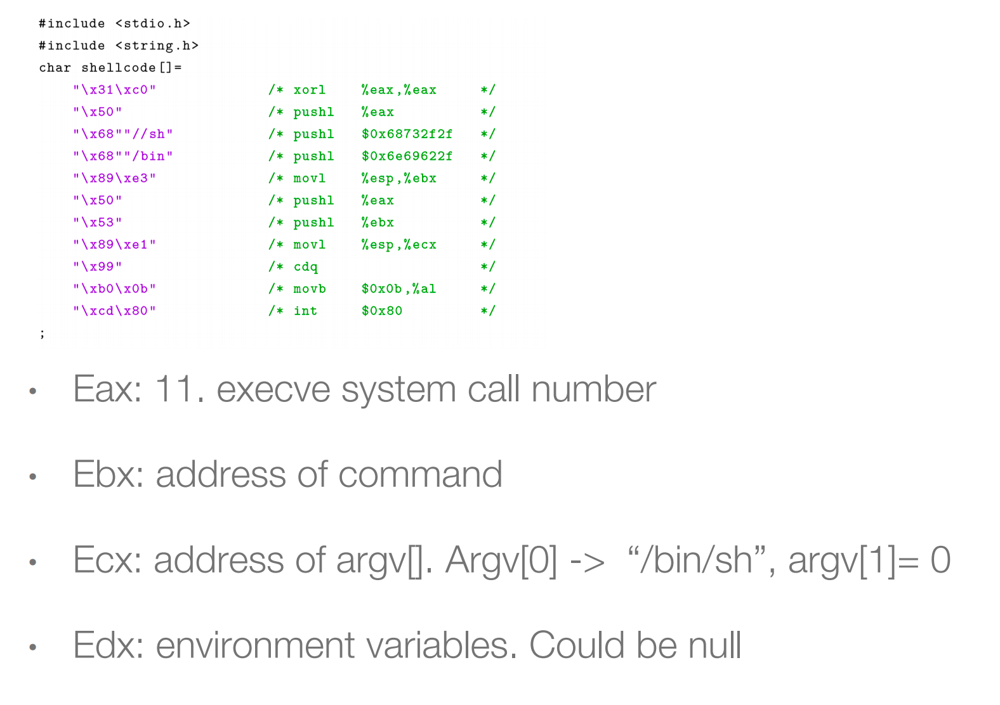
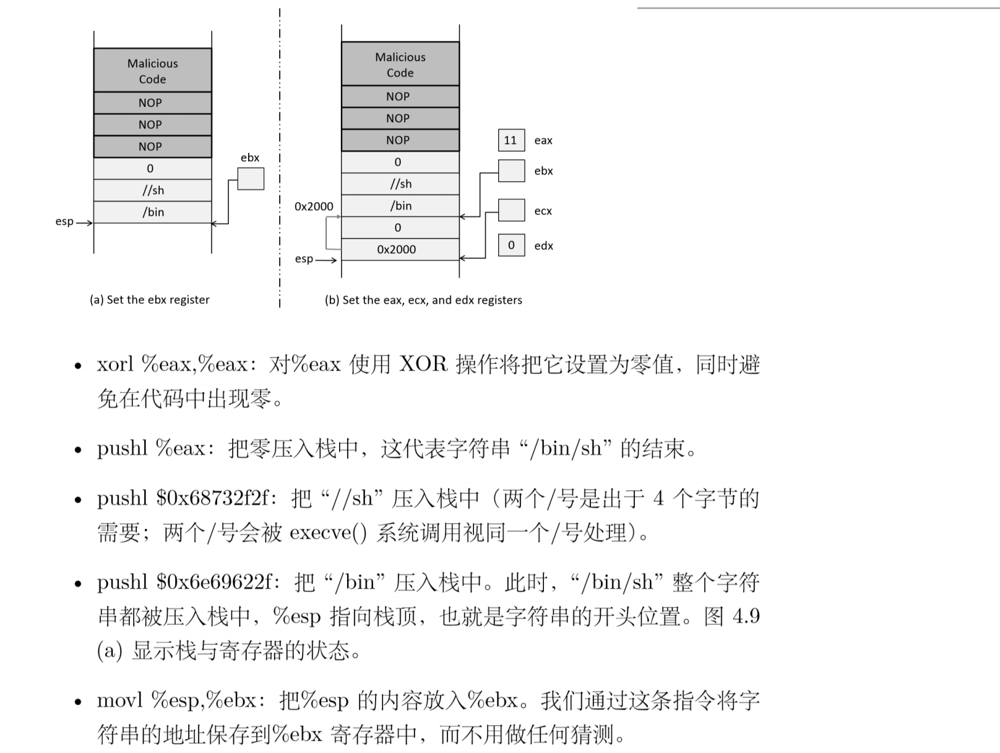
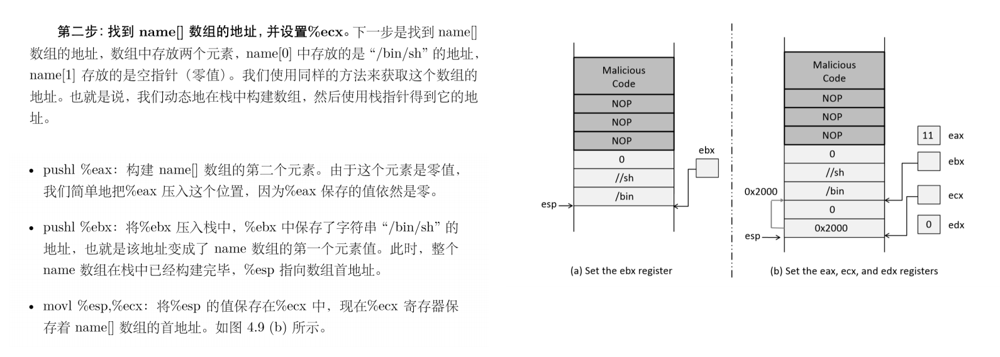
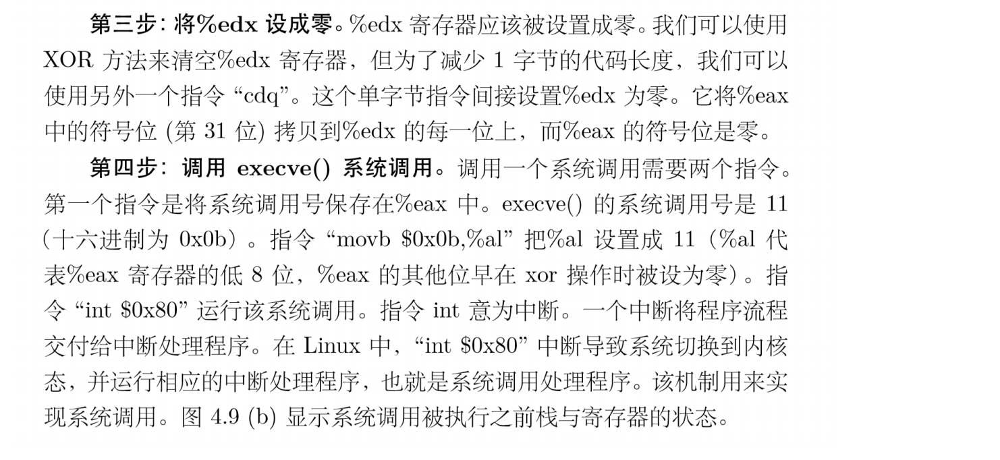

>5.8 第二课
### C语言的安全威胁

系统软件：操作系统、管理程序、网络服务器、固件、网络控制器、设备驱动程序、编译器……

C/C++的优点：编程模型接近机器模型；灵活性；效率性；

但C/C++容易出错：调试内存错误令人头疼、巨大的安全风险。错误类型比如，超出绑定的数组访问、手动内存管理、错误的强制类型转换。

内存错误的两种类别：空间上的内存错误，越界；时间上的内存错误，执行内存操作管理的代码时序发生了错误。

当然一些边界检查也可以加入到C语言的编译器当中去，但是当代码的复杂度增大的时候，精确的静态分析就比较困难，即使可以完成也要消耗极大的算力。

**No Array Bounds Checking**

```c
int a[10];
a[10] = 3;
```

```c
//不知道什么时候结束，读到null字符才结束
char* strcpy(char* destination, const char* source);
//就copy这么多，不管有没有越界
void * memcpy(void *to, const void *from, size_t numBytes);
```

**Memory Management**

`malloc`/`free`会有use after free、memory leak、double frees等问题；

**C Strings**

Buffer overflows、null-termination error、soff-by-one errors；

比如`gets()`不会考虑输入长度，有可能造成越界写，而`printf`也是打印一直到0字符，这里又会造成越界读。我们可以用`fgets(buf, size, stdin)`来读，但是比如我们要读取8个字节，size需要设置成9。

`strcpy()` => `char *strncpy(char *s1, const char *s2, size_t n)`

```c
int main(int argc, char* argv[]) {
		char a[16], b[16];
		strncpy(a, "0123456789abcdef", sizeof(a)); 
  	//这里的a没有0字符作为结尾，printf可能会造成segment fault
  	printf(“%s\n",a);
		strcpy(b, a);
}
```

### Buffer Overflow

**Program Memory Layout**

一个程序的内存结构：





---

**Stack Layout**

```c
void func(int a, int b)
{
  int x, y;
  x = a + b;
  y = a - b;
}
```

对于如上的函数，当`func()`被调用时，实参（从右往左）会被压入栈中，这是函数调用者做的，然后把返回地址放入栈中，然后pc进入callee函数，把原来的ebp（用来寻找原实参）`push bp & mov bp, sp`放入栈中，然后把callee函数的局部变量压入。



Buffer自底向上进行overwrite

return时候的指令，`mov sp, bp & pop bp`

---

当data超过了常规data结构的界限，就会产生Buffer Overflow。Buffer Overflow可能会修改return address(前向控制流)、function pointer(后向控制流)、local variable、heap data structure。

**修改返回地址：**

Case I: the overwritten return address is invalid -> 程序被crash；
Case II: the overwritten return address is valid but in kernel space -> 可能会抛异常；
Case III: the overwritten return address is valid, but points to data -> xbit没有被设置成1，还是会抛异常；
Case IV: the overwritten return address happens to be a valid one -> 成功利用漏洞；

---

可以利用NOP来增加跳转成功的概率（只需跳转到有害程序之前的任意一个NOP都可以正确执行）！

通过gdb去找buffer和return地址的偏移量：

---

而跳转到的有害程序，我们的例子中执行了一个系统调用，执行一个/bin/sh，最后会出来一个终端。

如下是执行该系统调用的算法：